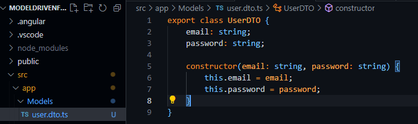
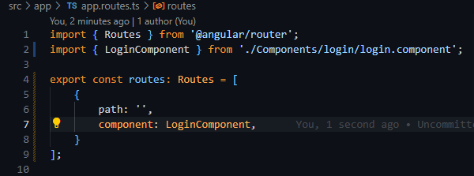
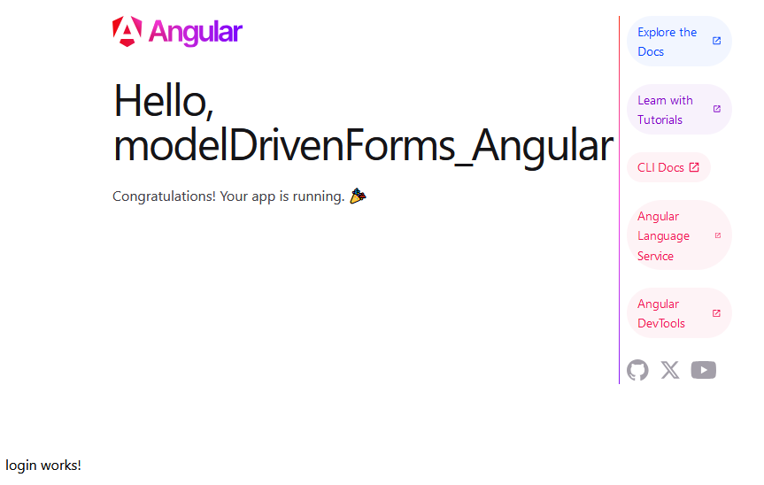

# Model Driven Forms

1. Import _FormsModule_ in _app.component.ts_.

    ```ts
    import { Component } from '@angular/core';
    import { FormsModule } from '@angular/forms';
    import { RouterOutlet } from '@angular/router';

    @Component({
      selector: 'app-root',
      standalone: true,
      imports: [RouterOutlet, FormsModule],
      templateUrl: './app.component.html',
      styleUrl: './app.component.css',
    })
    export class AppComponent {
      title = 'modelDrivenForms_Angular';
    }
    ```

2. We're gonna make a user authentication form, so we're going to save an email and a password. That's why we'll make a Model. Let's make a _Models_ folder inside of _/app_. And then a _UserDTO_ file inside. A Data Transfer Object is used to identify objects we're going to use to map entities coming from our backend.



3. Now, we'll make the auth component. For that, we want to create our new component inside _/app_. To do that, we are going to run `ng g c Components/login`.


4. We are also going to import the new component into _app.component.ts_.


5. Now, let's check that our login component works. To do that, let's go into _app.routes.ts_ and add our new component to the root of our app.



We will see the following "login works!" message when we visit our app in _localhost:4200_:



## Controller for LoginComponent

1. First, in _login.component.ts_ we import the _UserDTO_ class, and initialize it as _public_ with it's own constructor inside the _LoginComponent_ class.

2. Then, we make a _checkLogin_ method to check that the values of the email and password are OK.

```ts
import { Component } from '@angular/core';
import { UserDTO } from '../../Models/user.dto';

@Component({
  selector: 'app-login',
  standalone: true,
  imports: [],
  templateUrl: './login.component.html',
  styleUrl: './login.component.css'
})
export class LoginComponent {
  user: UserDTO = new UserDTO('', '');

  constructor() {}

  checkLogin(): void {
    console.log(
      'User email --> ' + 
        this.user.email +
      ', User password --> ' +
        this.user.password
    )
  }
}
```

**NOTE**: If we would have set the UserDTO class using the _!_ operator, we wouldn' have had to initialize the _user_ property inside LoginComponent with values, because Angular would have trusted us to set the values later.

```ts
// UserDTO using ! operator in user.dto.ts
export class UserDTO {
    email!: string;     // ! operator
    password!: string;  // ! operator

    constructor() {
        this.setUser();
    }

    setUser(): void {   // We should invoke this method at some point later on.
        this.email = 'Example@example.com';
        this.password = 'example123';
    }
}

// LoginComponent in login.component.ts
export class LoginComponent {
  user: UserDTO = new UserDTO();  // We don't set any values for the user object.

  constructor() {}

  checkLogin(): void {
    console.log(
      'User email --> ' + 
        this.user.email +
      ', User password --> ' +
        this.user.password
    )
  }
}
```

## HTML and styles for the Model Driven Form

1. First, we need to add the _FormsModule_ into our LoginComponent.

```ts
// In login.component.ts

import { Component } from '@angular/core';
import { UserDTO } from '../../Models/user.dto';
import { FormsModule } from '@angular/forms';     // We add this import
```

2. Then, we make the form structure with all the Angular shenannigans that will be explained next:

```html
<!-- login.component.html -->

<div class="main-container">
    <h1>Test Driven Forms App</h1>
    <form #loginForm="ngForm" (ngSubmit)="checkLogin()">
        <div>
            <label for="email">Email: </label>
            <input 
                type="email"
                name="email"
                [(ngModel)]="user.email"
                #email="ngModel"
                required
                placeholder="Email..."
            />
            <span [hidden]="email.valid || email.pristine" style="color: red">
                Email required
            </span>
        </div>

        <div>
            <label for="password">Password: </label>
            <input
                type="password"
                name="password"
                [(ngModel)]="user.password"
                #password="ngModel"
                required
                placeholder="Password..."
            />
            <span [hidden]="password.valid || password.pristine" style="color: red">
                Password required
            </span>
        </div>
        <div>
            <button type="submit" [disabled]="!loginForm.form.valid">Login</button>
        </div>
    </form>
</div>
```

The directive _ngForm_ allows us to check all the different states of the form and all its inputs, these being:

- **Valid**: Indicates that the form control has passed all validation checks.
- **Invalid**: The opposite of valid; it means the form control has failed at least one -lidation check.
- **Touched**: This state is true if the user has focused on the form control and then moved -ay (blurred) from it.
- **Untouched**: The opposite of touched; it means the user has not yet focused on the form -ntrol.
- **Pristine**: Indicates that the form control has not been modified by the user.
- **Dirty**: The opposite of pristine; it means the user has changed the value of the form control⁴.

These states help in tracking and responding to user interactions with the form, as shown in the _<span>_ validators (`[hidden]="email.valid || email.pristine`).

We add `#email=”ngModel”` and `#password=”ngModel”` to be able to check th state of each individual input.

Also, the directive _(ngSubmit)_ allows us to run a method, function or chunk of code when the form is submitted.

On the other hand, the _[(ngModel)]_ directive binds _user.email_ and _user.password_ to the values of their inputs in BOTH ways. That means that, if we change the value of the input, the value of _user.email_ and _user.password_; and if we change the values of  _user.email_ and _user.password_, the string showed in both inputs will change.

3. We make some CSS styles to add some flavour and some spice to the form.

```css
@import url('https://fonts.googleapis.com/css2?family=Open+Sans:ital,wght@0,300..800;1,300..800&display=swap');

div.main-container {
    display: flex;
    flex-direction: column;
    justify-content: center;
    align-content: center;
    justify-items: center;
    align-items: center;

    height: 100vh;

    font-family: "Open Sans", sans-serif;
}

h1 {
    font-size: 1.8em;
    text-align: center;
}

form {
    width: 25vw;
    padding: 2vw;
    background-color: rgba(0, 0, 0, 0.1);
    border-radius: 10px;
    box-shadow: 0 0 10px rgba(0, 0, 0, 0.1);
}

form > div {
    display: flex;
    justify-content: center;

    margin-bottom: 1vh;
}

form > div > label {
    flex-basis: 10vw;
    padding-right: 10px;
    font-weight: bold;
}

form > div > button {
    flex-basis: 10vw;

    background-color:deepskyblue;
    color: white;

    font-weight: bold;

    border: none;
    border-radius: 5px;

    cursor: pointer;

    padding: 0.5vh;
    margin-top: 2vh;
}

form > div > span {
    color: red;
    font-size: 0.8em;
    margin-left: 5px;
}
```

This would be the result:


4. We can see that it works if we write something in the inputs, hit _login_ and look at the console.

```
User email --> email, User password --> passwqwrjhsd
```

And if we delete all the text from the inputs, th form is **invalid** and won't let us login, appart from showng th errors in their dedicated _<span>_.


## Form validation
In this case, we will add some validations for an input and then validate the whole form inside a function once we hit the submit button.

To add the validations we just need to add them to the HTML as we would do if we weren't using angular.

```html
<input 
    type="email"
    name="email"
    [(ngModel)]="user.email"
    #email="ngModel"
    placeholder="Email..."
    required                                          <!-- validations -->
    pattern="[a-z0-9._%+-]+@[a-z0-9.-]+\.[a-z]{2,4}$" <!-- validations -->
/>
```

Then, to check different aspects and validations of our input we just need to access the _errors_ object of our input. For example, to show an error message when the pattern isn't correct, we would do the following:

```html
<span [hidden]="!email.errors?.['pattern'] || email.pristine">
  Invalid email
</span>
```

After this, we want to validate the whole form after we hit the submit button. To do this, in the HTML we need to invoke a submit function and pass the form object as the parameter, and not to disable the button in any case:

```html
<form #signInForm="ngForm" (ngSubmit)="signIn(signInForm)">
  ...
  ...

  <div>
    <button type="submit">Join Now</button>
  </div>
</form>
```

Then, we do the validation inside our component:

```ts
export class SignInComponent {
  user: UserDTO = new UserDTO('', '', '', '', '', '', new Date());

  signIn(form: NgForm): void {
    console.log(form);
    if (form.valid) {
      this.joinNow();
    } else {
      console.error('INVALID FORM!');
    }
  }
  
  joinNow(): void {
    console.log(
      'User email --> ' +
        this.user.email +
        ', User password --> ' +
        this.user.password +
        ', User name -->'+
        this.user.name +
        ', User surname1 -->'+
        this.user.surname1 +
        ', User surname2 -->'+
        this.user.surname2 +
        ', User alias -->'+
        this.user.alias +
        ', User birthdate -->'+
        this.user.birthdate.toISOString().split('T')[0]
    );
  }
}
```

## Aditional exercise

Let's assume that instead of doing authentication, we need to do a registration. Therefore, we propose making the following modifications for practice. Specifically, we propose the following steps:

- Create a new component `sign-in`.
- Create a new route `/sign-in` that points to the component created in the previous step.
- Extend the `UserDTO` model with the following fields:
  - `name`: text.
  - `surname1`: text.
  - `surname2`: text.
  - `alias`: text.
  - `birthDate`: date.
- Create the registration form in the `sign-in` component. The validations that must be met are as follows:
  - `Email`, `password`, `name`, `surname1`, `alias`, and `birthDate` are required fields.
  - The fields `name`, `surname1`, `surname2`, and `alias` must be between 5 and 25 characters.
  - The date must be in the format DD/MM/YYYY.
  - The email must have a valid email format.
- Display the new information in the console when the `Join Now` button is pressed. Unlike the previous example, where the submit button was enabled when the form was valid, we will make the form validation occur when the button is pressed. That is, the button will always be enabled, and when pressed, the form will be validated. If any field does not meet the validation, the specified red message will be displayed, and if the form is correct, we will launch the `joinNow` function, displaying the different fields in the console. This way, we will have both possible versions of handling the submit button.

NOT