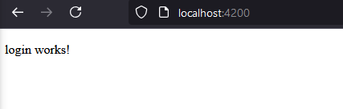
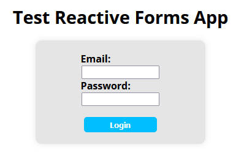
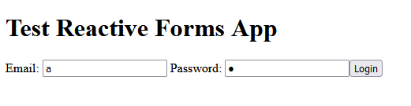
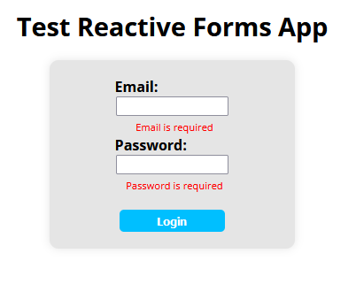
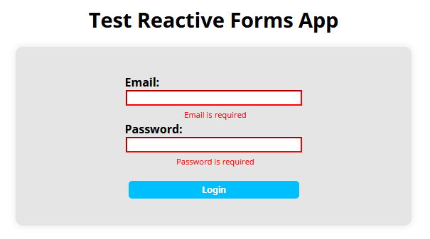

# Reactive Forms

1. The first thing we do is to create our new project using the Angular CLI while enabling the routing. We do this by running `ng new --routing reactiveForms_Angular`.
2. Then, we go to the app HTML file in _app.component.html_ and delete everything but the `<router-outlet/>` tag, so we don't have any of the preset information that Angular creates on the main page of our project.
3. Now, we need to import the _ReactiveFormsModule_ into our main module. So, inside of _app.component.ts_:

```ts
import { Component } from '@angular/core';
import { RouterOutlet } from '@angular/router';
import { ReactiveFormsModule } from '@angular/forms';   // We add this line

@Component({
  selector: 'app-root',
  standalone: true,
  imports: [RouterOutlet, ReactiveFormsModule],         // And include the new module to the imports
  templateUrl: './app.component.html',
  styleUrl: './app.component.css'
})
export class AppComponent {
  title = 'reactiveForms_Angular';
}
```

We're gonna make a user authentication form, so we're going to save an email and a password. That's why we'll make a Model. Let's make a _Models_ folder inside of _/app_. And then a _UserDTO_ file inside. A Data Transfer Object is used to identify objects we're going to use to map entities coming from our backend.

```ts
export class UserDTO {
    email: string;
    password: string;

    constructor(
        email: string,
        password: string,
    ){
        this.email = email;
        this.password = password;
    }
}
```
4. Now, we'll make the auth component. For that, we want to create our new component inside _/app_. To do that, we are going to run `ng g c Components/login`.


5. Now, let's check that our login component works. To do that, let's go into _app.routes.ts_ and add our new component to the root of our app.

```ts
import { Routes } from '@angular/router';
import { LoginComponent } from './Components/login/login.component';

export const routes: Routes = [
    {
        path:'',
        component: LoginComponent
    },
];
``` 

We will see the following "login works!" message when we visit our app in _localhost:4200_:



## Login Component implementation

1. So, first we need to import _FormBuilder, FormControll, FormGroup_ to our new component to build the form, and _UserDTO_ to save the information of the user.

```ts
// In login.component.ts

import { Component } from '@angular/core';
import { FormBuilder, FormControl, FormGroup, ReactiveFormsModule } from '@angular/forms';
import { UserDTO } from '../../Models/user.dto';

@Component({
  selector: 'app-login',
  standalone: true,
  imports: [ReactiveFormsModule],       // IMPORTANT
  templateUrl: './login.component.html',
  styleUrl: './login.component.css'
})
```

It's very important to import and include in the imports the _ReactiveFormsModule_ to be able to use reactive forms functionalities in our HTML later on.

2. Then, we declare and initialize the atributes of our component:

```ts
export class LoginComponent {
  user: UserDTO = new UserDTO('','');

  email: FormControl = new FormControl(this.user.email);
  password: FormControl = new FormControl(this.user.password);
  loginForm: FormGroup = new FormGroup({});

  constructor(private fb: FormBuilder) {
    this.loginForm = this.fb.group({
      email: this.email,
      password: this.password
    });
  }

  checkLogin(): void {
    this.user.email = this.email.value;
    this.user.password = this.password.value;

    console.log(
      'User: ',
      this.user.email,
      '\nPassword: ',
      this.user.password
    );
  }
}
```

First, we declare the _user_ attribute, which will hold the user information (email and password). Then we declare the two form inputs as FormControls to be able to access and validate both of them independently.

Finally, we declare the group of form controls (FormGroup) that will controll the whole form.Later, we need to initialize it using a form builder to create the form controller.

We've also implemented the method that processes the login information (_checkLogin()_).

3. Now, we just need to bind the form controller to the actual form inside of the HTML:

```html
<!-- In login.component.html -->

<div class="container">
    <h1>Test Reactive Forms App</h1>
    <form [formGroup]="loginForm" (ngSubmit)="checkLogin()">
        <label for="email">
            Email: 
        </label>
        <input type="email" [formControl]="email">
    
        <label for="password">
            Password: 
        </label>
        <input type="password" [formControl]="password">
        
        <button type="submit" [disabled]="!loginForm.valid">Login</button>
    </form>
</div>
```

4. Finally, we add some styles to the form:

```css
@import url('https://fonts.googleapis.com/css2?family=Open+Sans:ital,wght@0,300..800;1,300..800&display=swap');

div.main-container {
    display: flex;
    flex-direction: column;
    justify-content: center;
    align-content: center;
    justify-items: center;
    align-items: center;

    height: 100vh;

    font-family: "Open Sans", sans-serif;
}

h1 {
    font-size: 1.8em;
    text-align: center;
}

form {
    width: 25vw;

    display: flex;
    flex-direction: column;
    align-items: center;

    padding: 2vw;
    background-color: rgba(0, 0, 0, 0.1);
    border-radius: 10px;
    box-shadow: 0 0 10px rgba(0, 0, 0, 0.1);
}

form > label,
form > input,
form > button {
    width: 50%;
}

form > label {
    padding-right: 10px;
    font-weight: bold;
}

form > button {
    background-color:deepskyblue;
    color: white;

    font-weight: bold;

    border: none;
    border-radius: 5px;

    cursor: pointer;

    padding: 0.5vh;
    margin-top: 2vh;
}
```

This way, we have our form done:



## Validation

1. To be able to validate our inputs we need to import the _Validators_ module into our component:

```ts
import { Component } from '@angular/core';
import {
  FormBuilder,
  FormControl,
  FormGroup,
  ReactiveFormsModule,
  Validators } from '@angular/forms';             // This line
import { UserDTO } from '../../Models/user.dto';
import { CommonModule } from '@angular/common';   // And this line
```

We also imported the _CommonModule_ to be able to use _ngIf_ and other Angular tools in our HTML file.

2. Then, we just have to add the validators to the _FormControls_ as follows:

```ts
// In login.component.ts

export class LoginComponent {
  user: UserDTO = new UserDTO('','');

  email: FormControl = new FormControl(this.user.email, Validators.required);   // Here
  password: FormControl = new FormControl(this.user.password, Validators.required);   // And here
  loginForm: FormGroup = new FormGroup({});

  // Other things
}
```

_Validators.required_ just validates that the input has a value inside of it. There are a ton more that come prebuilt in Angular. For example, _Validators.minLength(N)_ checks that the length of the input is, at least, of N characters.

3. Now, we need to add some feedback so the user knows when and why the validation fails.

```html
<!-- In login.component.html -->

<div class="container">
    <h1>Test Reactive Forms App</h1>
    <form [formGroup]="loginForm" (ngSubmit)="checkLogin()">
        <label for="email">
            Email: 
        </label>
        <input type="email" [formControl]="email">
        <div class="errors" *ngIf="email.errors && email.dirty">
            <span>
                Email is required
            </span>
        </div>    <!-- This div -->

        <label for="password">
            Password: 
        </label>
        <input type="password" [formControl]="password">
        <div class="errors" *ngIf="password.errors && password.dirty">
            <span>
                Password is required
            </span>
        </div>    <!-- And this div -->

        <button type="submit" [disabled]="!loginForm.valid">Login</button>
    </form>
</div>
```

The error divs only show the error when there are errors in the validation of the input (remember that the only validation by now is that the input needs to be filled) and the input has been edited, so the errors don't show before the user edits the form.

4. Let's add some styles to the feedback messages:

```css
/* In login.component.css */

form > div > span {
    color: red;
    font-size: 0.7em;
    margin-left: 5px;
}
```

The inputs have been filled, so the button is enabled:



The inputs' content has been deleted by the user, so the button is disabled and the errors are showed to the user:



### Validation and input states

A single input can be in the following states:

- **Valid**: Indicates that the form control has passed all validation checks.
- **Invalid**: The opposite of valid; it means the form control has failed at least one validation check.
- **Touched**: This state is true if the user has focused on the form control and then moved away from it.
- **Untouched**: The opposite of touched; it means the user has not yet focused on the form conntrol.
- **Pristine**: Indicates that the form control has not been modified by the user.
- **Dirty**: The opposite of pristine; it means the user has changed the value of the form control.

And every state has its own css class:

```css
/* field value is valid */
.ng-valid {}

/* field value is invalid */
.ng-invalid {}

/* field has not been clicked in, tapped on, or tabbed over */
.ng-untouched {}

/* field has been previously entered */
.ng-touched {}

/* field value is unchanged from the default value */
.ng-pristine {}

/* field value has been modified from the default */
.ng-dirty {}
```

Knowing this, we can add different styles depending on the state of the input. For example, let's add a red border to the inputs, but only when they are invalid and have been edited by the user:

```css
/* In login.component.css */

form > input.ng-invalid.ng-dirty {
    border-color: red;
}
```
This is what happens to our example when we edit and then delete our inputs:



### Custom validators

Let's make a custom validator that checks if the input's email is different from "email@email.com".

1. First, we need to create a _Directives_ folder inside of _/app_, and the proper file to store our custom validator.


2. Then, we will create our validator. Validators allways need to return a _ValidatorFn_ function, which will either return a _ValidationErrors_ object when the input is invalid, or null when it's valid.

```ts
import { AbstractControl, ValidationErrors, ValidatorFn } from "@angular/forms";

export function checkInvalidKeyWord(nameRe: RegExp): ValidatorFn {
    // Validation functions must return a ValidatorFn object
    return(control: AbstractControl): ValidationErrors | null => {
        const forbidden = nameRe.test(control.value);

        // If the input and the regex match, the input will be invalid
        // and the function will return the ValidationErrors object invalidKeyWord.
        // And if they don't, the input is valid, so the function returns null. 

        return forbidden ? {invalidKeyWord: {value: control.value}} : null;
    };
}
```

3. Now, we need to import and use the new custom validator for the email input form the past example.

```ts
// In login.component.ts

// ...
import { UserDTO } from '../../Models/user.dto';
import { checkInvalidKeyWord } from '../../Directives/check-invalid-keyword.validator';     // Import the custom validator

// ...

export class LoginComponent {
  user: UserDTO = new UserDTO('','');

  email: FormControl = new FormControl(this.user.email, [
    Validators.required,
    checkInvalidKeyWord(/email@email.com/)      // Use the validator for the email input, passing the unwanted email as regex argument.
  ]);
  password: FormControl = new FormControl(this.user.password, [
    Validators.required,
    Validators.minLength(8)
  ]);

  // ...
}
```

4. Now we just need to implement feedback for the user in the HTML:

```html
<label for="email">
    Email: 
</label>

<input type="email" [formControl]="email">

<div class="errors" *ngIf="email.errors && email.dirty">
    <span *ngIf="email.errors?.['required']">
        Email is required
    </span>

    <!-- New error span message -->
    <span *ngIf="email.errors?.['invalidKeyWord']">
        email&#64;email.com is not a valid email.
    </span>
</div>
```

This way, if we write "email@email.com" in our email input, we get the following result:

