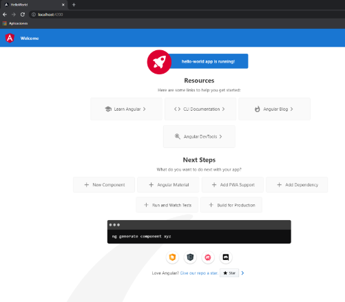

# How to install Angular in Windows

1. Install Node.js from ([here](https://nodejs.org/en/)).
2. Restart your computer to finish Node instalation.
3. Open Powershell as Admin and execute `node -v` and `npm -v`.
   
4. Install Angular executing `npm install -g @angular/cli` in Poweshell as Admin.
   1. If you get the following error follow the next step:
    ```
    ng : No se puede cargar el archivo npm\ng.ps1 porque la ejecución de scripts está deshabilitada en este sistema.
    ```
   2. Execute `Set-ExecutionPolicy RemoteSigned -Scope CurrentUser` in Poweshell as Admin.
5. To check if Angular is correctly installed we can create a new project and execute it by running `ng new hello-world` in Powershell as Admin.
6. Now, enter the project's directory running `cd hello-world`.
7. Now, if we run `ng serve --open` and enter [localhost:4200](http://localhost:4200/) in our browser, we will see the following screen.
   