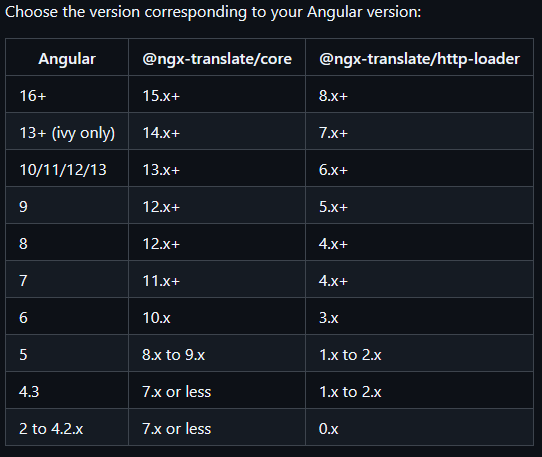
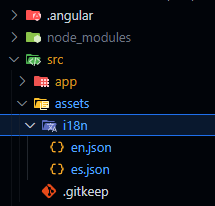

# Internationalization with i18n
## ngx-translate

### Sources
- [ngx-translate Github Repo](https://github.com/ngx-translate/core?tab=readme-ov-file#installation)
- [ngx-translate Youtube Tutorial](https://www.youtube.com/watch?v=NVFVbah2aWU)

### Instalation

First, you need to look at the following table to know wich versions you need for your project, depending on your Angular version. The updated table is always on the [ngx-translate Github Repo](https://github.com/ngx-translate/core?tab=readme-ov-file#installation).



You will need to install the _core_ and _http-loader_ libraries. Let's say that we're using Angular 14:

```bash
npm install @ngx-translate/core@14.0.0 --save --save-exact
npm install @ngx-translate/http-loader@7.0.0 --save --save-exact
```

We use the _--save-exact_ flag to save the exact version we're installing in _package.json_ for future installations.

### Configuration

**IMPORTANT**: THIS INFORMATION IS MORE SPECIFIC THAN THE GUIDE IN THE OFFICIAL REPO.

1. First, we need to import _TranslateModule_, _TranslateLoader_, _TranslateHttpLoader_ and _HttpClient_ into _app.module.ts_.

```ts
// In app.module.ts

import { HttpClientModule, HttpClient, HTTP_INTERCEPTORS } from '@angular/common/http';
import { TranslateModule, TranslateLoader } from '@ngx-translate/core';
import {TranslateHttpLoader} from '@ngx-translate/http-loader';
```

2. Now, we need to create the _Loader_ function:

```ts
// In app.module.ts

import { TranslateModule, TranslateLoader } from '@ngx-translate/core';     // All the imports
import {TranslateHttpLoader} from '@ngx-translate/http-loader';

export function HttpLoaderFactory(http: HttpClient) {
  return new TranslateHttpLoader(http);
}
```

3. Then, we configure the loader and the default language:

```ts
@NgModule({
  declarations: [
    // All of the declarations
    //...
  ],
  imports: [
    // Other imports
    //...
    TranslateModule.forRoot({       // Here
      loader: {
          provide: TranslateLoader,
          useFactory: HttpLoaderFactory,
          deps: [HttpClient]
      },
      defaultLanguage: 'en'
  })
  ],
  providers: [
    {
      provide: HTTP_INTERCEPTORS,
      useClass: AuthInterceptorService,
      multi: true,
    },
  ],
  bootstrap: [AppComponent],
})
export class AppModule {}
```

Although it's suposed to be very out of date, this is [the official W3C list](https://www.w3.org/International/O-charset-lang.html) of i18n languages and abbreviations, which you can use for _ngx-translate_.

4. Finally, we just need to set the default language and the language we will load the website with in our AppComponent:

```ts
// In app.component.ts

import { Component } from '@angular/core';
import { TranslateService } from '@ngx-translate/core';     // Import TranslateService

@Component({
  selector: 'app-root',
  templateUrl: './app.component.html',
  styleUrls: ['./app.component.scss']
})
export class AppComponent {
  title = 'blog-uoc-project-front';

  constructor(private translate: TranslateService) {    // Inject the service and use it
    this.translate.setDefaultLang('en');
    this.translate.use('en');
  }
}
```

### Usage

First, we need to create a _i18n_ foder inside of _/src/assets_. Inside of it we will make as many JSON files as languages we want our website to support. Every file wil have the i18n language code as the file's name. For example, the english translation file will be named _en.json_.



Now, the simplest use we can give to this tool is a simple translation.

```json
// In en.json
{
    "message": "This is a message"
}
```

```html
<!-- In any HTML file of our app -->

<p> {{ message | translate }} </p>
<!-- Would print "This is a message" -->
```

In this case, we're using the translate tool as a pipe, which means we can use parameters on it.

```json
// In en.json
{
    "message": "This is a message",
    "MESSAGE_WITH_PARAMETERS": {
        "helloSomething": "Hello {{ whatever }}"
    }
}
```

```html
<!-- In any HTML file of our app -->
<h1> {{ "MESSAGE_WITH_PARAMETERS" | translate: { whatever: "world"} }} </h1>
<!-- Would print "Hello world" -->

<p> {{ "message" | translate }} </p>
<!-- Would print "This is a message" -->
```

Notice that, we can also use JSON object structures to organize our translations as we want.

### Switching languages

Let's keep our previous example, where we only had two languages: English (_en_) and Spanish (_es_).

We have a header where we want to implement a button that changes the language.

First, we have to take into account that the button will have to display the language it would change the website's language to if we would press it. To do this, we just need to implement a simple translation:

```json
// In en.json
{
    // Other translations
    // ...

    "HEADER": {
        "home": "Home",
        "login": "Log in",
        "register": "Register",
        "language": "Español"       // Here
    }
}
```

```json
// In es.json
{
    // Other translations
    // ...

    "HEADER": {
        "home": "Inicio",
        "login": "Iniciar sesión",
        "register": "Registrarse",
        "language": "English"       // Here
    }
}
```

```html
<!-- In header.component.html -->

<div *ngIf="showNoAuthSection">
  <button (click)="home()">{{ "HEADER.home" | translate }}</button>
  <button (click)="login()">{{ "HEADER.login" | translate }}</button>
  <button (click)="register()">{{ "HEADER.register" | translate }}</button>
  <button (click)="switchLanguage()">{{ "HEADER.language" | translate }}</button>   <!-- Here -->
</div>
```

This way, the button will display the opposite language form the one tha page is in. Notice that we're calling a function from our component. Let's implement it.

```ts
// In header.component.ts

constructor(
  // Some injections
  // ...
  private translate: TranslateService     // Important
) {
  // ...
}

switchLanguage(): void {
  if (this.translate.currentLang === 'en')
    this.translate.use('es');
  else if (this.translate.currentLang === 'es')
    this.translate.use('en');
}
```

We can get the current language from _this.translate.currentLang_, and change it with __this.translate.use()_. It's that easy.

### Specific example

For this example, let's say that we have a form where the labels of the _title_ and _description_ inputs are translated. We also have error messages for both inputs:
- Both are required
- The title cannot be more that 55 chars long.
- The description cannot be more than 255 chars long.
- 
So we have the following translations in English and Spanish:

```json
// In en.json
{
    "POST_ATTRIBUTES": {
        "title": "Title",
        "description": "Description",
    },

    "FORM_ERRORS": {
        "maxChars": "{{attribute}} can be max {{numChars}} characters long.",
        "required": "{{attribute}} is required"

    },
}
```

```json
// In es.json
{
    "POST_ATTRIBUTES": {
        "title": "Título",
        "description": "Descripción",
    },

    "FORM_ERRORS": {
        "maxChars": "{{attribute}} puede tener un máximo de {{numChars}} caracteres.",
        "required": "{{attribute}} es obligatorio"
    },
}
```

In this case we would need to insert *POST_ATTRIBUTES.title*, *POST_ATTRIBUTES.description*, _55_ and _255_ into the error messages. For the numbers there aren't any problems since we don't need to translate them, but the attibutes are translations.

We could insert the translations into public attributes from the component and then call them from the view:

```ts
// In post-form.component.ts

import { TranslateService, LangChangeEvent } from '@ngx-translate/core';
import { Subscription } from 'rxjs';

@Component({
  selector: 'app-post-form',
  templateUrl: './post-form.component.html',
  styleUrls: ['./post-form.component.scss'],
})
export class PostFormComponent implements OnInit {
  // A lot of attributes
  // ...
  translateTitle: string;
  translateDescription: string;

  constructor(
    // A lot of injections
    // ...
    private translate: TranslateService
  ) {
    // A lot of initializations
    // ...
    this.translateTitle = '';
    this.translateDescription = '';

    this.translate.get('POST_ATTRIBUTES.title').subscribe((res: string) => {
      this.translateTitle = res;
    });

    this.translate.get('POST_ATTRIBUTES.description').subscribe((res: string) => {
      this.translateDescription = res;
    });

    // Some other stuff
  }
}
```

```html
<!-- In post-form.component.html -->

<div *ngIf="title.errors.required">
  {{ "FORM_ERRORS.required" | translate:{attribute: translateTitle} }}
</div>
<!-- Title is required. RIGHT -->
<!-- Title es obligatorio. WRONG -->

<div *ngIf="title.errors.maxlength">
  {{ "FORM_ERRORS.maxChars" | translate:{attribute: translateTitle, numChars: 55} }}
</div>
<!-- Title can be max 55 characters long. RIGHT -->
<!-- Title puede tener un máximo de 55 caracteres. WRONG -->

<div *ngIf="description.errors.required">
  {{ "FORM_ERRORS.required" | translate:{attribute: translateDescription} }}
</div>
<!-- Description is required. RIGHT -->
<!-- Description es obligatorio. WRONG -->

<div *ngIf="description.errors.maxlength">
  {{ "FORM_ERRORS.maxChars" | translate:{attribute: translateDescription, numChars: 255} }}
</div>
<!-- Description can be max 255 characters long. RIGHT -->
<!-- Description puede tener un máximo de 255 caracteres. WRONG-->
```

In this case, we get the translations int the constructor, when the component is loading. But if we change the language after the component has loaded, the attributes inside the component that hold the translations won't update.

To update the attributes we need to subscribe to the translation service:

```ts
// In post-form.component.ts


import { TranslateService, LangChangeEvent } from '@ngx-translate/core';
import { Subscription } from 'rxjs';

@Component({
  selector: 'app-post-form',
  templateUrl: './post-form.component.html',
  styleUrls: ['./post-form.component.scss'],
})
export class PostFormComponent implements OnInit {
  // A lot of attributes
  // ...
  translateTitle: string;
  translateDescription: string;

  private langSubscription: Subscription;

  constructor(
    // A lot of injections
    // ...
    private translate: TranslateService
  ) {
    // A lot of initializations
    // ...
    this.translateTitle = '';
    this.translateDescription = '';

    this.attributeTranslateUpdate();

    this.langSubscription = this.translate.onLangChange.subscribe((event: LangChangeEvent) => {
      this.attributeTranslateUpdate();
    });

    // Some other stuff
  }

  private attributeTranslateUpdate(): void {
    this.translate.get('POST_ATTRIBUTES.title').subscribe((res: string) => {
      this.translateTitle = res;
    });

    this.translate.get('POST_ATTRIBUTES.description').subscribe((res: string) => {
      this.translateDescription = res;
    });
  }
}
```

First, we've moved the attribute updated code to a function for clearance. We call this function first in the constructor when the component is loading, and we stablish that it's called again every time tha language changes using a subscription. We don't need to change anything else in the HTML.

This way, if we change the language after the component has loaded, the proper translations appear.