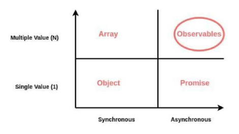

# Observables (rxjs module)ç

Observables are a tool to work with sequences of asynchronous data.



## Observables VS Promises
Observables and Promises are both used to handle asynchronous operations, but they differ significantly in terms of functionality, flexibility, and usage patterns.

Pormises return a single value (or an error) once the operation completes. Once a promise is resolved or rejected, it cannot be reused. They start the operation immediately upon creation. You can't "subscribe" to a promise multiple times; it will resolve only once.

Meanwhile, Observables can emit multiple values over time, meaning it can produce a stream of values and handle events in real-time. They're also *lazy*. They won’t start producing values until there's a subscription to it. You can create multiple subscriptions, and each one will trigger the observable to start executing.

The following example will show a function from a service created to manage posts from an API. You can access the full project inside of the *Repo* folder.

```ts
// In /services/post.service.ts
// Declaration of updatePost() as a Promise
updatePost(postId: string, post: PostDTO): Promise<PostDTO> {
  return this.http.put<PostDTO>(this.urlBlogUocApi + '/' + postId, post).toPromise();
}

// Declaration of updatePost() as an Observable
updatePost(postId: string, post: PostDTO): Observable<PostDTO> {
    return this.http.put<PostDTO>(this.urlBlogUocApi + '/' + postId, post).pipe(
      catchError((error) => {
          this.sharedService.errorLog(error.error);

          return of(new PostDTO('', '', 0, 0, new Date()));
      })
    );
  }
```

```ts
// In /components/posts/post-form/post-form.component.ts
// Call to updatePost() as a Promise
try {
    await this.postService.updatePost(this.postId, this.post);

    responseOK = true;
} catch (error: any) {
    errorResponse = error.error;
    this.sharedService.errorLog(errorResponse);
}

// Call to updatePost() as an Observable
this.postService.updatePost(this.postId, this.post).subscribe({
  complete: () => {
      responseOK = true;
  }
});
```
Notice how, we changed the error handling from the calling to the declaring of the function. We can also handle errors when calling the function, but it's considered best practice not doing it.

## Error handling
There are two ways to do it:

1. When declaring the observable. **This is a best practice**:

```ts
// In /services/post.service.ts

likePost(postId: string): Observable<updateResponse> {
  return this.http.put<updateResponse>(this.urlBlogUocApi + '/like/' + postId, NONE_TYPE).pipe(
    catchError((error) => {
        this.sharedService.errorLog(error.error);

        return of({ affected: -1 } as updateResponse);
    })
  );
}
```

In this case, after handling the error, we must return the same type as the observable. In this case, *of* creates an observable with the value and type we input as a parameter.

2. When running (subscribing) to the Observable:

```ts
// This isn't on any file of the Repo folder.
// It's juts an example

this.postService.likePost(postId).subscribe({
  error: (error) => {
    this.sharedService.errorLog(error.error);
  }
});
```

## `complete()` VS. `next()`
When running asynchronous code, we may want to run synchronous code only after the asynchronous one. And when treating with Observables, which are collections of asynchronous data, we might want to run synchronous code after every chung of data to process every item in a certain way. This is why we use `complete()` and `next()`.

Let's say that, in our project, we have a component with an attribute that holds all posts that come from an API, and a function that subscribes to an Observable that makes ths HTTP request to the API and returns those posts.

```ts
// In Services/post.service.ts
// This would be the service that makes the HTTP request to the API
getPosts(): Observable<PostDTO[]> {
  return this.http.get<PostDTO[]>(this.urlBlogUocApi).pipe(
    catchError((error) => {
        this.sharedService.errorLog(error.error);

        return of([new PostDTO('', '', 0, 0, new Date())]);
    })
  );
}
```

```ts
// In Components/home/home.component.ts
export class HomeComponent {
  posts!: PostDTO[];
  
  // Other unimportant attributes

  showButtons: boolean;
  constructor(
    private postService: PostService,
    // Some other injections
  ) {
    // Some constructor actions

    // Call to function that calls the PostService
    this.loadPosts();
  }

  private async loadPosts(): Promise<void> {
    // Some logic

    this.postService.getPosts().subscribe({
      next: (postResult) => {
        this.posts = postResult;
      },
      complete: () => {
        const tmpCategories: CategoryDTO[][] = [...this.posts.map(post => post.categories)];
        let allCategoriesUID: string[] = [];

        tmpCategories.forEach((array: CategoryDTO[]) => {
          array.forEach((category: CategoryDTO) => {
            if (!allCategoriesUID.includes(category.categoryId)) {
              this.allCategories.push(category);
              allCategoriesUID.push(category.categoryId);
            }
          })
        })
      }
    });
  }
}
```

We process the data in the *next()* block every time we get new information, and do everything else in the *complete()* block, only after the Observable is done emiting information.

* `next()`: This function runs each time the Observable emits a new value (or item). It’s called for every emission, so if the Observable emits multiple values over time, `next()` will execute for each of them. It’s ideal for processing or handling each individual data item as it arrives.

* `complete()`: This function runs only once, when the Observable has finished emitting all values and completes its sequence. It signifies the end of the Observable’s lifecycle, meaning no more values will be emitted, and no further calls to `next()` will occur. The `complete()` function is ideal for cleanup actions or final steps that should only happen after all data is received and the Observable has stopped.
