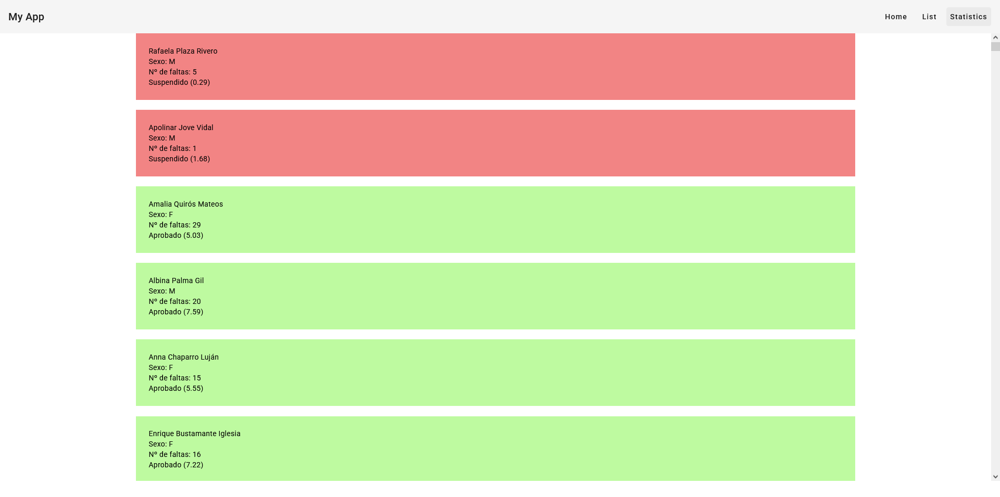
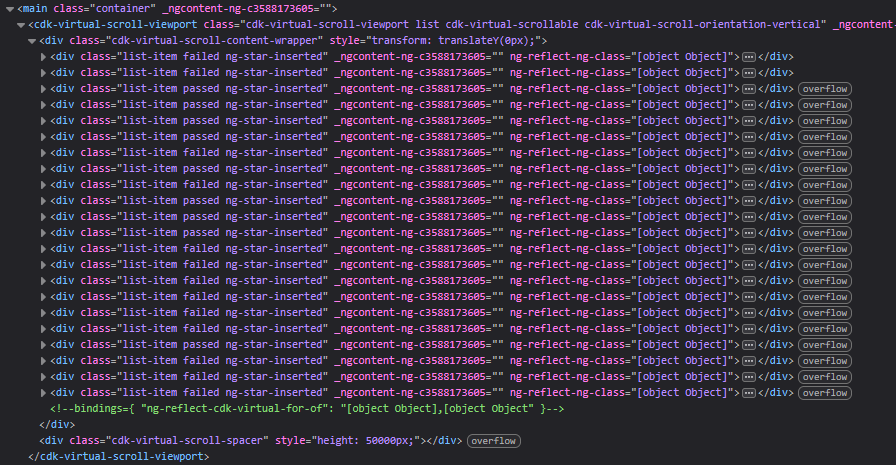
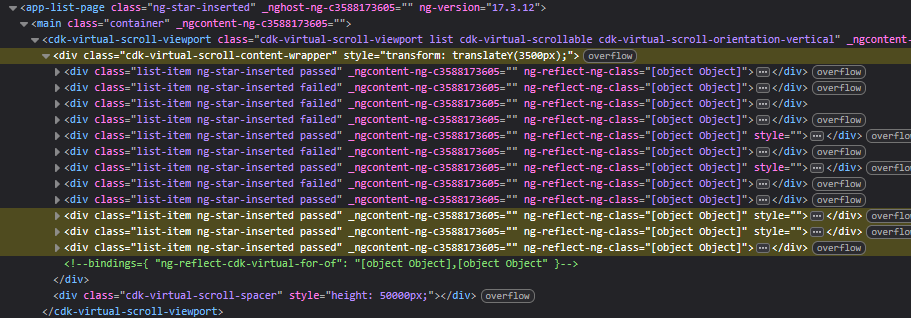

# Virtual Scrolling

Let's say that we have a list with 1000 items we want to load and display for the user to see. Probably, the user won't be able to see all of them at the same time, so why load and render them all?

With Virtual Scrolling, only the elements that fit on screen are loaded and rendered. To do this we will use Angular Material, a component's library made for this framework.

## How to implement Virtual Scrolling

1. First, we have to install the Angular Material package into our project. So we run `ng add @angular/material`, choose a theme, typography and animations configuration.
2. Then, we have to import the propper module into the component we're implementing Virtual Scrolling into. In this case, we have a *list-page* component, that was generated by running `ng generate module list-page --route list --module app.module`. This will generate our component as a module, meaning that, apart from our `list-page.component.ts` file, where we have the logic of our component; we also have a `list-package.module.ts` file, where we manage our module dependencies (where we import all the modules we need to be able to run our component).

```ts
// In list-page.module.ts

// ...
import {MatListModule} from '@angular/material/list';
import {ScrollingModule} from '@angular/cdk/scrolling';

@NgModule({
  declarations: [
    ListPageComponent
  ],
  imports: [
    // ...
    MatListModule,
    ScrollingModule
  ]
})
export class ListPageModule { }
```

Notice that we also imported the `MatListModule` dependency because we are going to use Angular Material's list component.

3. Now, we need our data. For the sake of simplicity, let's say that we get it from a CSV file, and that we use a custom made service to fetch it. That would make it so our `list-page.component.ts` file looks like this:

```ts
import { Component } from '@angular/core';

import { gradeDTO } from '../../Models/grade.dto';
import { GradesService } from '../../Services/grades.service';

@Component({
  selector: 'app-list-page',
  templateUrl: './list-page.component.html',
  styleUrl: './list-page.component.css',
})
export class ListPageComponent {
  grades: gradeDTO[] = [];

  constructor(private gradesService: GradesService) {}

  ngOnInit() {
    this.gradesService.getGrades().subscribe((grades) => {
      this.grades = grades;
    });
  }

  trackById(index: number, item: gradeDTO) {
    return item.idAlumno;
  }
}
```

Also, just so you see the structure of the data, this is the `grade.dto.ts` file, where the data's structure is defined:

```ts
export interface gradeDTO {
  idAlumno: number,
  nombre: string,
  apellidos: string,
  sexo: string,
  notaFinal: number,
  faltasAsistencia: number
}
```

4. Then, our component's view would look like this:

```html
<!-- In list-page.component.html -->

<main class="container">
  <cdk-virtual-scroll-viewport itemSize="50" class="list">
    <div
      *cdkVirtualFor="let grade of grades"
      class="list-item"
      [ngClass]="{ passed: grade.notaFinal >= 5, failed: grade.notaFinal < 5 }"
    >
      <div>{{ grade.nombre }} {{ grade.apellidos }}</div>

      <div>Sexo: {{ grade.sexo }}</div>

      <div>Nº de faltas: {{ grade.faltasAsistencia }}</div>

      @if (grade.notaFinal >= 5) {
      <div>Aprobado ({{ grade.notaFinal }})</div>
      } @else {
      <div>Suspendido ({{ grade.notaFinal }})</div>
      }
    </div>
  </cdk-virtual-scroll-viewport>
</main>
```

The problem of this implementation of virtual scrolling is that it creates an independent box with a scroll that's different from the one of the main page. To patch this, we just make the `<cdk-virtual-scroll-viewport>` element take the whole page:

```css
/* In list-page.component.css */
.container {
  height: 90vh;
}

.list {
  width: 100%;
  height: 100%;
  margin: auto;
}

.list-item {
  margin-inline: auto;
  margin-bottom: 2vh;
  padding: 1.5rem;

  width: 70%;
}

.passed {
  background-color: rgba(126, 245, 66, .5);
}

.failed {
  background-color: rgba(230, 11, 11, .5);
}
```

This would make our page look like this:



We know that our data is an array of 1000 elements, and that we should be rendering one list item per array element. But if we inspect the HTML structure of the page, we see that the elements are loaded 50 at a time.



And if we scroll down, the Virtual Scroll loads another set of items and unloads the older ones that aren't visible anymoreAA:


