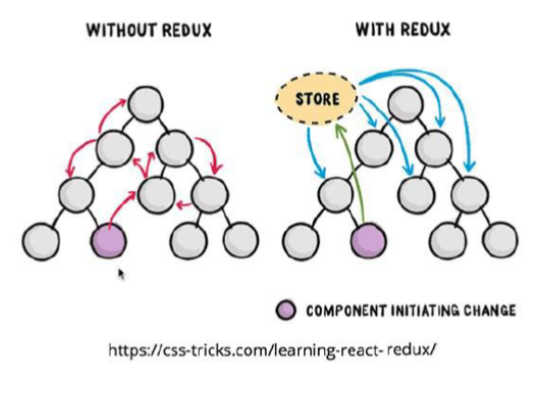
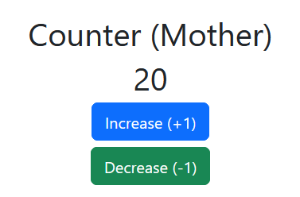
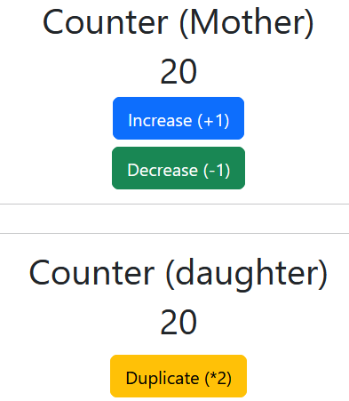
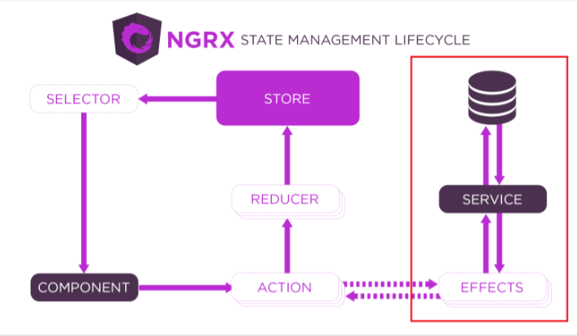
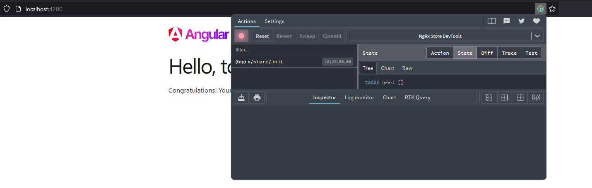
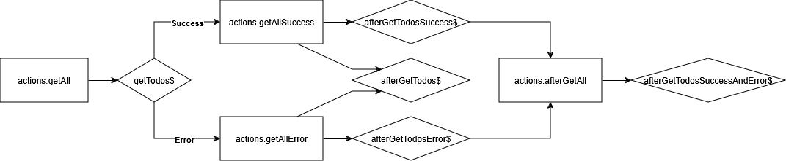

# REDUX
Redux (typically implemented with NgRx) is a state management pattern that centralizes application state and makes it predictable by organizing it in a single, immutable data store. Redux in Angular uses actions (describing events), reducers (pure functions that update the state based on actions), and selectors (queries to read specific parts of the state). This setup makes it easier to manage and debug complex state changes, especially in large applications, by ensuring that the app's state is updated in a consistent, traceable way. NgRx integrates Redux principles directly with Angular's reactive programming model, making it highly compatible with Angular applications.

## Basic concepts
* **Store**: The Store is a centralized, immutable state container that holds the entire application state. It acts as a single source of truth, where all components can access and update data consistently.
* **Actions**: Actions are dispatched events that describe a change or event happening in the application (e.g., loading data, updating a user). Each action has a type (a unique identifier) and can carry a payload with additional data for the event.
* **Reducers**: Reducers are pure functions that take the current state and an action as inputs, and return a new state based on the action’s type and payload. They define how the application state changes in response to actions.
* **Selectors**: Selectors are functions used to retrieve specific data from the Store, optimizing performance by minimizing unnecessary state recalculations and helping manage complex data structures.



In short, when we want to make a change to the application's data, we subscribe to the **store** and we dispatch an **action**. By doing that, we are calling the **reducer**, which combines the current state of the **store** with the **action** we dispatched to make the change to the state of the **store**.

## Installation and configuration
After creating our Angular project, we need to install `ngrx/store`. So we run `npm install @ngrx/store --save`.

Now, for this example, we will be implementing a counter app. This app will have a counter and three components:

* **Mother component**: This component will show the counter and will have a button to **increase** (+1) and to **decrease** (-1) it.
* **Daughter component**: This one will also display the counter's value, and will have a **duplicate** (*2) button.

Inside of the Repo folder you will have an implementation of the app with and without REDUX so you can compare.

1. We need to create all the different actions, so we create a `app/Counter/counter.actions.ts` file. Inside of it, we define all the actions **just by name. We don't need to implement what they do here.**

```ts
// In app/Counter/counter.actions.ts
import { createAction, props } from "@ngrx/store";

export const increment = createAction('[Counter Component] Increment');
export const decrement = createAction('[Counter Component] Decrement');
export const duplication = createAction('[Counter Component] Duplication');
```

**NOTE**: DO NOT SET THE SAME TYPE FOR TWO DIFFERENT ACTIONS. THIS WILL CAUSE ERRORS THAT ARE VERY DIFFICULT TO TRACE.

```ts
// In app/Counter/counter.actions.ts
import { createAction, props } from "@ngrx/store";

// THIS IS VERY WRONG!!!

export const increment = createAction('[Counter Component] Increment');
export const decrement = createAction('[Counter Component] Increment');
export const duplication = createAction('[Counter Component] Increment');
```

2. Now we need to create the reducer, so we make a `app/Counter/counter.reducer.ts` file. Inside of it, we will have a function that's basically a switch case conditional selector that takes the current state of te **store** and an action as arguments.

```ts
// In app/Counter/counter.reducer.ts

import { Action, createReducer, on } from "@ngrx/store";
import * as actions from "./counter.actions"; // We import all actions into an object called "actions"

// We set the initial state of the counter
export const initialState = 20;

// We call a reducer constructor that takes the initial state
// Then decides what to do with it.
const _counterReducer = createReducer(
  initialState,
  on(actions.increment, (state) => state + 1),  // Increment adds 1
  on(actions.decrement, (state) => state - 1),  // Decremend substracts 1
  on(actions.duplication, (state) => state * 2)  // Duplicate duplicates
);

// We export a function that takes the state and an action
export function counterReducer(state: number | undefined, action: Action) {
  return _counterReducer(state, action);
}
```

This is the same as doing the following:

```ts
export function counterReducer(state: number = 20, action: Action) {
  switch (action.type) {
    case increment.type:
      return state + 1;

    case decrement.type:
      return state - 1;

    case duplication.type:
      return state * 2;

    default:
      return state;
  }
}
```

3. Next, we need to add the reducer to the store.

```ts
// In app.config.ts

// Other imports
// ...
import { provideStore } from '@ngrx/store';
import { counterReducer } from './Counter/counter.reducer';

export const appConfig: ApplicationConfig = {
  providers: [
    provideZoneChangeDetection({ eventCoalescing: true }),
    provideRouter(routes),
    provideClientHydration(),
    provideStore({ counter: counterReducer }) // We add the reducer, that sets the "counter" property form the store
  ]
};
```

**NOTE**: In previous versions of Angular, we would do it this way:

```ts
// In app.module.ts

// Other imports
// ...
import { StoreModule } from '@ngrx/store';
import { counterReducer } from './counter.reducer.ts';

@NgModule({
  declarations: [
    // A lot of declarations
    // ...
  ],
  imports: [
    // A lot of imports
    // ...
    StoreModule.forRoot({counter: counterReducer})
  ],
  providers: [
    {
      // Some providers
    },
  ],
  bootstrap: [AppComponent],
})
export class AppModule {}
```

5. Next, for simplicity, we need to create an interface that represents a state of the store. In this case it will be easy, as the store only holds one attribute: counter. We need to create a `app/app.reducer.ts` file.

```ts
// In app/app.reducer.ts
export interface AppState {
  counter: number;
}
```

6. Now, let's create our mother component.

```ts
// In app.component.ts
import { Store } from '@ngrx/store';
import * as actions from "./Counter/counter.actions";
import { AppState } from './app.reducer';
// Other imports
// ...

@Component({
  selector: 'app-root',
  standalone: true,
  imports: [
    RouterOutlet
  ],
  templateUrl: './app.component.html',
  styleUrl: './app.component.scss'
})
export class AppComponent {
  title = 'counter-app-with-redux';
  // The attribute that will hold the counter value inside of this component
  counter!: number;

  constructor(private store: Store<AppState>) {
    // In larger apps, we would have a ton of properties,
    // so we select only the ones that we want and subscribe to them.
    this.store.select('counter').subscribe((counter) => {
      this.counter = counter;
    });
  }

  increase(): void {
    // By calling dispatch and passing an action to it
    // REDUX by itself calls the reducer and passes the action and the current state.
    this.store.dispatch(actions.increment());
  }

  decrease(): void {
    this.store.dispatch(actions.decrement());
  }
}
```

This would be the HTML structure. We are using bootstrap for the styles, but feel free to add your own:

```html
<!-- In app.component.html -->

<div class="jumbotron d-flex flex-column justify-content-center align-items-center min-vh-100">
  <div class="container text-center">
      <div class="row" style="text-align: center">
          <div class="col">
              <h1> Counter (Mother) </h1>
              <h1>{{ counter }}</h1>
          </div>
      </div>
  </div>

  <div class="row" style="text-align: center;">
    <div class="col">
      <button
        (click)="increase()"
        type="button"
        class="btn btn-primary btn-lg"
      >
        Increase (+1)
      </button>
    </div>
  </div>

  <div class="row mt-2" style="text-align: center;">
    <div class="col">
      <button
        (click)="decrease()"
        type="button"
        class="btn btn-success btn-lg"
      >
        Decrease (-1)
      </button>
    </div>
  </div>
</div>
```

It should look like this:



If we press the buttons, it adds and subtracts from the counter.

7. Now, let's create our child component. To do that, we will run `ng g c Counter/daughter`. This will create a new folder inside of our Counter directory for the new component.

```ts
// In daughter.component.ts

import { Store } from '@ngrx/store';
import * as actions from '../counter.actions';
import { AppState } from '../../app.reducer';
// Other imports
// ...

@Component({
  selector: 'app-daughter',
  standalone: true,
  imports: [],
  templateUrl: './daughter.component.html',
  styleUrl: './daughter.component.scss'
})
export class DaughterComponent {
  // The attribute that will hold the counter value inside of this component
  counter!: number;

  constructor(private store: Store<AppState>) {
    // In larger apps, we would have a ton of properties,
    // so we select only the ones that we want and subscribe to them.
    this.store
      .select('counter')
      .subscribe((counter) => { this.counter = counter; });
  }

  duplicate(): void {
    // By calling dispatch and passing an action to it
    // REDUX by itself calls the reducer and passes the action and the current state.
    this.store.dispatch(actions.duplication());
  }
}
```

This is the HTML sctructure for the daughter component.

```html
<!-- In daughter.component.html -->
<div class="row text-center d-flex flex-column justify-content-center align-items-center">
  <div class="col">
    <h1> Counter (daughter) </h1>
    <h1>{{ counter }}</h1>
  </div>

  <div class="row mt-2" style="text-align: center;">
    <div class="col">
      <button (click)="duplicate()" type="button" class="btn btn-warning btn-lg">
        Duplicate (*2)
      </button>
    </div>
  </div>
</div>
```

Now, let's insert our daughter component into our mother component.

```html
<!-- In app.component.html -->
<div class="jumbotron d-flex flex-column justify-content-center align-items-center min-vh-100">
  <!-- All the HTML code from the previous step -->

  <hr class="w-100 h-1"/>
  <hr class="w-100 h-1"/>

  <app-daughter></app-daughter>
</div>
```

Now, it should look like this:



And that's it. We have an app with several components that all modify the same data, but don't need to comunicate between each other, because everything is stored in the **store**.

## Props
We can add props to actions, that act like arguments of a function. For example, let's add a prop to our *duplicate* action so we have to pass a **2** as a prop when we call it.

1. First let's modify our action.
```ts
// In counter.actions.ts

// export const duplication = createAction('[Counter Component] Duplication');
export const duplication = createAction('[Counter Component] Duplication', props<{ number: number }>());
```

**VERY IMPORTANT**: *props* is a funtion, so you need to add the parenthesis at the end.

2. Now, we need to change the reducer so it multiplies the state by *number*

```ts
// In counter.reducer.ts
const _counterReducer = createReducer(
  initialState,
  on(actions.increment, (state) => state + 1),
  on(actions.decrement, (state) => state - 1),
  on(actions.duplication, (state, { number }) => state * number) // Here
);
```

3. Finally, we just need to call it properly in our daughter component:

```ts
// In daughter.component.ts
duplicate(): void {
  this.store.dispatch(actions.duplication({ number: 2 }));
}
```

## Effects
The most common way of having information in your app is to request it from a back end. To do that in REDUX we use effects.



We usually also have a service that makes all the HTTP requests.

The philosophy behind effects is that they would trigger and do their thing every time a certain action runs.

But first of all, we need to install the effects module: `npm install @ngrx/effects`.

For this example, we made a few new actions:

```ts
// In actions/todo.actions.ts

export const getAll = createAction('[TODOS] Get all TODOS');

export const getAllSuccess = createAction(
  '[TODOS] TODOS retrieved SUCCESSFULLY',
  props<{ todos: TodoDTO[] }>()
);

export const getAllError = createAction(
  '[TODOS] TODOS retrieved UNSUCCESSFULLY',
  props<{ payload: any }>()
);
```

And this is what they do in the reducer:

```ts
// In reducers/todo.reducer.ts
on(actions.getAll, (state) => ({ ...state, loading: true })),
on(actions.getAllSuccess, (state, { todos }) => {
  return {
  ...state,
  loading: false,
  loaded: true,
  todos: [...todos],
  };
}),
on(actions.getAllError, (state, { payload }) => ({
  ...state,
  loading: false,
  loaded: false,
  error: payload,
}))
```

We also updated our `AppState` interface:

```ts
// In reducers/todo.reducer.ts

export interface TodoState {
  todos: TodoDTO[];
  loading: boolean;
  loaded: boolean;
  error: any;
}
```

As we're retrieveing information from a database, this could take some time. Therefor we need to state when we're loading the information, and when the informations is already loaded. That's why the `getAll` action only "activates" the loading state. Then, once the datd retrieving operation finishes (either succesfully or on an error), the loading state "deactivates" and the state updates. To stage the course of action is the function of the `TodoEffect.getTodo$` we made.

```ts
// In effects/todo.effects.ts

import { Actions, createEffect, ofType } from '@ngrx/effects';
import { catchError, map, mergeMap, of } from 'rxjs';
import { take } from 'rxjs';

import * as actions from '../actions';
import { TodoService } from '../services/todo.service';

@Injectable()
export class TodosEffects {
  constructor(private actions$: Actions, private todoService: TodoService) {}

  getTodos$ = createEffect(() =>
    this.actions$.pipe(
      ofType(actions.getAll),
      take(1),
      mergeMap(() =>
        this.todoService.getAllTodos().pipe(
          map((todos) => {
            return actions.getAllSuccess({ todos: todos })
          }),
          catchError((err) => of(actions.getAllError({ payload: err })))
        )
      )
    )
  );
}
```

**Note**: We end the `getTodos$` method with *$* because it's the standard.

Line by line, the method `getTodos$` listens ONLY to the `getAll` action. Then, let's the following block run only once (because sometimes it can happen that the block runs many times at once). Then, we merge the outputs of the Observable returned by the `todoService.getAllTodos()`, which is the one making the HTTP request. For every output, we map it to run the `getAllSuccess` action no success, but if it fails, it runs the `getAllError` action.

Next, we need to configure the effects like we did for the store inside of `app.config.ts` (or `app.module.ts` in older versions of Angular):

```ts
// In app.config.ts

// Other imports
// ...
import { provideStore } from '@ngrx/store';
import { todoReducer } from './reducer/todo.reducer';
import { provideEffects } from '@ngrx/effects';
import { TodoEffects } from './effects/todo.effects';

export const appConfig: ApplicationConfig = {
  providers: [
    provideZoneChangeDetection({ eventCoalescing: true }),
    provideRouter(routes),
    provideClientHydration(),
    provideStore({ todos: todoReducer }),
    provideEffects([AuthEffects])   // Here
  ]
};

// In app-module.ts for older versions of Angular
// Other imports
// ...
import { StoreModule } from '@ngrx/store';
import { TodoReducer } from './reducer/todo.reducer';
import { EffectsModule } from '@ngrx/effects';
import { TodoEffects } from './effects/todo.effects';

@NgModule({
  declarations: [
    // A lot of declarations
    // ...
  ],
  imports: [
    // A lot of imports
    // ...
    StoreModule.forRoot({counter: counterReducer}),
    EffectsModule.forRoot([TodoEffects])    // Here
  ],
  providers: [
    {
      // Some providers
    },
  ],
  bootstrap: [AppComponent],
})
export class AppModule {}

```

Now, we would just need to run `this.store.dispatch(actions.getAll());` to run the `getAll` action, so it triggers the effect.

## Redux Dev Tools
This is a browser extension we can use to check all the info about the store, states, actions, etc...

1. To use it, first we need to install it in our project by running `npm i @ngrx/store-devtools --save`.

2. We are going to need environmental variables for the configuration. Before Angular 15 the propper files were generated automatically, but for recent versions we need to run `ng generate environments`. This will create an *environments* folder that holds files for environmental variables for development and production. We will only use the `environments.ts` file by now for simplicity. We have to add a new variable:

```ts
// In environments/environment.ts
export const environment = {
  production: true
};
```

3. Now, we have to configure it as a provider. It's very similar as how we configured the store for REDUX as a provider inside of `app.config.ts`.

```ts
// In app.config.ts

// Other important imports
// ...
import { provideStoreDevtools } from '@ngrx/store-devtools';
import { environment } from '../environments/environment';

export const appConfig: ApplicationConfig = {
  providers: [
    // Other important providers
    // ...
    provideStoreDevtools({  // We add this default configuration
      maxAge: 25,
      logOnly: environment.production // Enable log-only mode in production
    })
  ]
};
```

4. Next, we need to install the browser extension for [Firefox](https://addons.mozilla.org/en-US/firefox/addon/reduxdevtools/) or [Chrome](https://chromewebstore.google.com/detail/redux-devtools/lmhkpmbekcpmknklioeibfkpmmfibljd?hl=en&pli=1).

5. Finally, if we run `ng serve` and go to `localhost:4200` we can use our extension:



## Frequent errors

* When trying to configure the store in `app.config.ts`, we might get the following error:
```ts
export const appConfig: ApplicationConfig = {
  providers: [
    provideZoneChangeDetection({ eventCoalescing: true }),
    provideRouter(routes),
    provideStore({ counter: counterReducer })  // The line producing the error
  ]
};

// ERROR:
// Type '(state: number, action: Action<string>) => TodoDTO[]' is not assignable to type 'ActionReducer<number, Action<string>>'.
//   Types of parameters 'state' and 'state' are incompatible.
//     Type 'number | undefined' is not assignable to type 'number'.
//       Type 'undefined' is not assignable to type 'number'.
```

In this case, we see that the error happens when we try to assign `undiefined` to `number` (or the type we choose for our states) or viceversa. This is fixed by asigning a default value to the state parameter of our reducer, so it never is `undefined`.

```ts
// In counter.reducer.ts
export const initialState = 20;

const _counterReducer = createReducer(
  initialState,
  on(actions.increment, (state) => state + 1),
  on(actions.decrement, (state) => state - 1),
  on(actions.duplication, (state, { number }) => state * number),
  on(actions.resetAction, () => initialState)
);

// Before
export function counterReducer(state: number | undefined, action: Action) {
  return _counterReducer(state, action);
}

// After
export function counterReducer(state: number = initialState, action: Action) {
  return _counterReducer(state, action);
}
```

* How can I run a block of code AFTER an action has been completed?
[Source](https://stackoverflow.com/questions/42547715/executing-code-after-dispatch-is-completed-while-using-ngrx)

If we remember our effects example, we had three actions:

```ts
// In actions/todo.actions.ts

export const getAll = createAction('[TODOS] Get all TODOS');

export const getAllSuccess = createAction(
  '[TODOS] TODOS retrieved SUCCESSFULLY',
  props<{ todos: TodoDTO[] }>()
);

export const getAllError = createAction(
  '[TODOS] TODOS retrieved UNSUCCESSFULLY',
  props<{ payload: any }>()
);
```

And this is what they do in the reducer:

```ts
// In reducers/todo.reducer.ts
on(actions.getAll, (state) => ({ ...state, loading: true })),
on(actions.getAllSuccess, (state, { todos }) => {
  return {
  ...state,
  loading: false,
  loaded: true,
  todos: [...todos],
  };
}),
on(actions.getAllError, (state, { payload }) => ({
  ...state,
  loading: false,
  loaded: false,
  error: payload,
}))
```

The idea is that the main action (`getAll`) would trigger an effect that, on success would run `getAllSuccess` and on error would run `getAllError`.

```ts
// In effects/todo.effects.ts

// Some imports

@Injectable()
export class TodosEffects {
  constructor(private actions$: Actions, private todoService: TodoService) {}

  getTodos$ = createEffect(() =>
    this.actions$.pipe(
      ofType(actions.getAll),
      take(1),
      mergeMap(() =>
        this.todoService.getAllTodos().pipe(
          map((todos) => {
            return actions.getAllSuccess({ todos: todos })
          }),
          catchError((err) => of(actions.getAllError({ payload: err })))
        )
      )
    )
  );
}
```

Now, let's say that we wanted to run a block of code AFTER the `getAll` action has been completed succesfully, another one after it fails, and another one without taking into account whether it fails or succeeds.

First we need to make a new action. Let's call it `afterGetAll`.

```ts
// In actions/todo.actions.ts

export const afterGetAll = createAction('[TODOS] Get all TODOS: Completed');
```

Now, let's add our new effects.

```ts
// In effects/todo.effects.ts

// Some imports

@Injectable()
export class TodosEffects {
  constructor(private actions$: Actions, private todoService: TodoService) {}

  getTodos$ = createEffect(() =>
    this.actions$.pipe(
      ofType(actions.getAll),
      take(1),
      mergeMap(() =>
        this.todoService.getAllTodos().pipe(
          map((todos) => {
            return actions.getAllSuccess({ todos: todos })
          }),
          catchError((err) => of(actions.getAllError({ payload: err })))
        )
      )
    )
  );

  // This runs AFTER the getAll action succeeds
  afterGetTodosSuccess$ = createEffect(() =>
    this.actions$.pipe(
      ofType(actions.getAllSuccess),
      take(1),
      map(() => {
        // Your success code here

        return actions.afterGetAll();
      })
    )
  );

  // This runs AFTER the getAll action fails
  afterGetTodosError$ = createEffect(() =>
    this.actions$.pipe(
      ofType(actions.getAllSuccess),
      take(1),
      map(() => {
        // Your error code here

        return actions.afterGetAll();
      })
    )
  );

  // This runs AFTER the getAll action, whether it fails or succeeds
  afterGetTodos$ = createEffect(() =>
    this.actions$.pipe(
      ofType(actions.getAllSuccess, actions.getAllError),
      take(1),
      map(() => {
        // Your code here
      })
    ),
    // We disable this option when we're not going to
    // dispatch any action in our block of code
    { dispatch: false }
  );

  // This runs AFTER the afterGetTodosSuccess$ and afterGetTodosError$
  afterGetTodosSuccessAndError$ = createEffect(() =>
    this.actions$.pipe(
      ofType(actions.afterGetAll),
      take(1),
      map(() => {
        // Your code here
      })
    ),
    // We disable this option when we're not going to
    // dispatch any action in our block of code
    { dispatch: false }
  );
}
```

This is the flux diagram:


