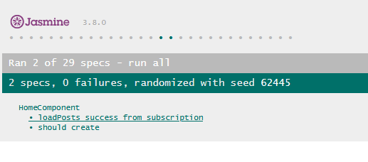
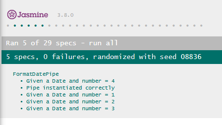

# Unit testing with Jasmine and Karma
**For this specific guide we're going to be working with Angular 15 instead of Angular 17.**

To make and run Angular unit tests we have to use Karma and Jasmine, but the configuration is very simple.

When you create an Angular Project with Angular Cli, it installs everything we need for the tests.

You may have noticed that, when we create a new component/pipe/service using the Cli (`ng generate component Components/home`), it generates a folder with 4 files:


* `home.component.html` is what we call the view. That's the HTML structure of the component.
* `home.component.scss` is where we add all of the CSS and SCSS styles.
* `home.component.ts` is the logic of the component. Every attribute, method, import, etc is here.
* `home.component.spec.ts` is the testing file. Here we're going to declare all of our unit tests. To start the testing service we run `ng serve`.

## Unit tests for a component
To begin, let's say that in our *home* component we have a method that subscribes to a *Post Service* that loads a bunch of posts from an API. Therefor, we want to test two things:

- If the component instantiates correctly.
- If the `loadPosts` method calls the service and loads the posts correctly.

But first we have to configure the testing environment.

```ts
// In Components/home/home.component.spec.ts

describe('HomeComponent', () => {
  // This represents the component.
  // We have to make it a variable so we can invoke it at will.
  let component: HomeComponent;

  // The fixture helps managing the component.
  let fixture: ComponentFixture<HomeComponent>;

  // A beforeEach() block runs before every test.
  // We can declare as many as we want.
  beforeEach(() => {
    // We configure the "environment" in which the component will be invoked.
    TestBed.configureTestingModule({
      imports: [HttpClientTestingModule],
      declarations: [HomeComponent],
      providers: [PostService],
      schemas: [CUSTOM_ELEMENTS_SCHEMA, NO_ERRORS_SCHEMA]
    }).compileComponents();
  });

  beforeEach(() => {
    fixture = TestBed.createComponent(HomeComponent);
    component = fixture.componentInstance;
    // With this line we simulate that the component
    // goes through every state (ngOnInit, ngAfterContentInit, etc).
    fixture.detectChanges();
  });

  // YOUR TESTS GO HERE
});
```

As you can see, we have to declare our component as if it was a variable, and a fixture to manage it. Then, before every test, we set the "sandbox" so it resembles the real environment. That means that, if we are using a service we have to put it into our providers, we have to declare our own component, and import any external module that we need. In this case `HttpClientTestingModule` is used to simulate a real HTTP request to an external API.

```ts
// In Components/home/home.component.spec.ts

// TEST 1: Tests if the component instantiates correctly.
it('should create', () => {
  expect(component).toBeTruthy();
});

// TEST 2: Tests if the `loadPosts` method calls theservice and loads the posts correctly.
it('loadPosts success from subscription', () => {
  // We declare our Post Service as if we were injecting it
  const postService = fixture.debugElement.injector.get(PostService);
  // This is the fake list of posts to be returned
  const listPosts: PostDTO[] = [];
  // This replaces the call to Post Service and returns the fake list of posts.
  const spy = spyOn(postService, 'getPosts').and.returnValue(of(listPosts));

  // We call the method to be tested.
  component['loadPosts']();

  // For the test to be successful the spy service mus have been called, and the fake list of posts must have been returned.
  expect(spy).toHaveBeenCalled();
  expect(component.posts.length).toBe(0);
});
```

Now, if everything goes well, we can run `ng test`, go to `http://localhost:9876/debug` and see the state of our tests. We can eve go to a specific component to only see the tests from that component.



## Unit tests for a pipe
Let's say that we have a pipe that given a `Date` (for example '2021-09-25T00:00:00.000Z') and a `number` from 1 to 4 we get the following outputs:

* If number = 1, the output is '25092021'.
* If number = 2, the output is '25 / 09 / 2021'.
* If number = 3, the output is '25/09/2021'.
* If number = 4, the output is '2021-09-25'.

```ts
// In Pipes/format-date.pipe.ts

@Pipe({
  name: 'formatDate',
})
export class FormatDatePipe implements PipeTransform {
  transform(value: Date, ...args: number[]): unknown {
    let dd: number;
    let mm: number;
    let yyyy: number;
    let ddFormat: string;
    let mmFormat: string;
    let newFormat: string = '';

    let dateTransform = new Date(value);
    let type: number = args[0];

    dd = dateTransform.getDate();
    mm = dateTransform.getMonth() + 1;
    yyyy = dateTransform.getFullYear();

    ddFormat = this.needZero(dd);
    mmFormat = this.needZero(mm);

    if (type === 1) {
      newFormat = ddFormat + mmFormat + yyyy;
    }
    if (type === 2) {
      newFormat = ddFormat + ' / ' + mmFormat + ' / ' + yyyy;
    }
    if (type === 3) {
      newFormat = ddFormat + '/' + mmFormat + '/' + yyyy;
    }
    if (type === 4) {
      newFormat = yyyy + '-' + mmFormat + '-' + ddFormat;
    }

    return newFormat;
  }

  private needZero(checkNumber: number): string {
    return checkNumber < 10 ? '0' + checkNumber : String(checkNumber);
  }
}
```

In this case, the test file will look like this:

```ts
// In Pipes/format-date.pipe.spec.ts

describe('FormatDatePipe', () => {
  let pipe: FormatDatePipe;
  const date: Date = new Date("2022-03-25");

  beforeEach(() => {
    pipe = new FormatDatePipe();
  });

  it('Pipe instantiated correctly', () => {
    expect(pipe).toBeTruthy();
  });

  it('Given a Date and number = 1', () => {
    const result = pipe.transform(date, 1);

    expect(result).toBe("25032022");
  });

  it('Given a Date and number = 2', () => {
    const result = pipe.transform(date, 2);

    expect(result).toBe("25 / 03 / 2022");
  });

  it('Given a Date and number = 3', () => {
    const result = pipe.transform(date, 3);

    expect(result).toBe("25/03/2022");
  });

  it('Given a Date and number = 4', () => {
    const result = pipe.transform(date, 4);

    expect(result).toBe("2022-03-25");
  });
});
```

Now, if everything goes well, we can run `ng test`, go to `http://localhost:9876/debug` and see the state of our tests. We can eve go to a specific component to only see the tests from that component.



## Unit tests for a route (redirection)
For this example, we have a header component with a series of buttons inside a nav menu. Each button redirects the user to a different route using a simple method.

```html
<!-- In Components/header/header.component.html -->

<!-- THE VIEW -->

<div *ngIf="showAuthSection">
  <button (click)="navigationTo('posts')">Admin posts</button>
  <button (click)="navigationTo('categories')">Admin categories</button>
</div>
```
```ts
// In Components/header/header.component.ts

navigationTo(option: string): void {
  switch(option) {
    case 'posts':
      this.router.navigateByUrl('posts');
    break;

    case 'categories':
      this.router.navigateByUrl('categories');
    break;
  }
```

We are going to test this specific method from our component.

```ts
// In Components/header/header.component.spec.ts

class TestComponentForRoutes {};

describe('HeaderComponent', () => {
  let component: HeaderComponent;
  let fixture: ComponentFixture<HeaderComponent>;

  beforeEach(async () => {
    await TestBed.configureTestingModule({
      imports: [
        RouterTestingModule.withRoutes([
          {
            path: 'posts',
            component: TestComponentForRoutes,
          },
          {
            path: 'categories',
            component: TestComponentForRoutes,
          },
          // ...
        ])
      ],
      declarations: [ HeaderComponent ],
      schemas: [CUSTOM_ELEMENTS_SCHEMA, NO_ERRORS_SCHEMA]
    })
    .compileComponents();
  });

  beforeEach(() => {
    fixture = TestBed.createComponent(HeaderComponent);
    component = fixture.componentInstance;
    fixture.detectChanges();
  });

  it('El componente se crea correctamente', () => {
    expect(component).toBeTruthy();
  });

  it('Should navigate to posts', () => {
    const router = TestBed.inject(Router);
    const spy = spyOn(router, 'navigateByUrl');

    component.navigationTo('posts');

    expect(spy).toHaveBeenCalledWith('posts');
  });

  it('Should navigate to categories', () => {
    const router = TestBed.inject(Router);
    const spy = spyOn(router, 'navigateByUrl');

    component.navigationTo('categories');

    expect(spy).toHaveBeenCalledWith('categories');
  });
});
```

This is pretty much like testing a component, but we need to define all of the routes we are going to redirect the user to our `RouterTestingModule`, and instead of defining the component we would find on each route, to avoid importing all of them and making the test file dirty and big, we create a mock class.

Again, the spy intercepts the call to the router service so we can check if said call has been made after calling the component's navigation method.

Now, if everything goes well, we can run `ng test`, go to `http://localhost:9876/debug` and see the state of our tests. We can eve go to a specific component to only see the tests from that component.


## Unit tests for a service
In this case, we are working on an app where there are posts that belong to categories. We have a CategoriesService that manages all of the categories related requests to the API.

```ts
export interface deleteResponse {
  affected: number;
}

@Injectable({
  providedIn: 'root',
})
export class CategoryService {
  private urlBlogUocApi: string;
  private controller: string;

  constructor(private http: HttpClient, private sharedService: SharedService) {
    this.controller = 'categories';
    this.urlBlogUocApi = 'http://localhost:3000/' + this.controller;
  }

  getCategoriesByUserId(userId: string): Observable<CategoryDTO[]> {
    return this.http
      .get<CategoryDTO[]>('http://localhost:3000/users/categories/' + userId)
      .pipe(catchError(this.sharedService.handleError));
  }

  createCategory(category: CategoryDTO): Observable<CategoryDTO> {
    return this.http
      .post<CategoryDTO>(this.urlBlogUocApi, category)
      .pipe(catchError(this.sharedService.handleError));
  }

  // Many more methods
}
```

As we can see, the `getCategoriesByUserId` makes a GET HTTP request to the API. We are going to test if the request is made and if it is indeed a GET type request.

```ts
// This is a mock list of categories to be returned by the mock request.
const categoriesList: CategoryDTO[] = [
  {
    userId: '',
    categoryId: '1',
    css_color: '',
    description: '',
    title: ''
  }
];

describe('CategoryService', () => {
  let service: CategoryService;
  let httpMock: HttpTestingController;

  beforeEach(() => {
    TestBed.configureTestingModule({
      imports:[HttpClientTestingModule],
      providers: [CategoryService],
      schemas: [CUSTOM_ELEMENTS_SCHEMA, NO_ERRORS_SCHEMA]
    });
    service = TestBed.inject(CategoryService);
  });

  beforeEach(() => {
    service = TestBed.inject(CategoryService);
    httpMock = TestBed.inject(HttpTestingController);
  });

  // After every test, we make sure that no other test runs if there are pending requests.
  afterEach(() => {
    httpMock.verify();
  });

  it('should be created', () => {
    expect(service).toBeTruthy();
  });

  it('GET Method and getCategoriesByUserId return a list of categories', () => {
    service.getCategoriesByUserId('1').subscribe((resp: CategoryDTO[]) => {
      expect(resp).toEqual(categoriesList);
    })

    const req = httpMock.expectOne('http://localhost:3000/users/categories/1');

    expect(req.request.method).toBe('GET');
    req.flush(categoriesList);
  });

  it('POST Method and createCategory returns the newly created category', () => {
    service.createCategory(category).subscribe((resp: CategoryDTO) => {
      expect(resp).toEqual(category);
    });

    const req = httpMock.expectOne('http://localhost:3000/categories');

    expect(req.request.method).toBe('POST');
    req.flush(category);
  });
});
```

This is very similar to the testing we made for a component. In this case, let's look at the second one.

First, we call the intended method from our service (we try to get all the categories asiciated to the user with ID = 1) and subscribe to the result. Then, inside of the subscription, we check that the response is the categories list we declared at the begining.

Then, we configure the mock HTTP service to expect a request to the URL that the service's method will send the request to.

Next, we check that the request is a GET request, and return the categories list we declared at the begining.

This way, if the request made by `getCategoriesByUserId` works as intended, it will make a GET request that returns the mock categories list.

Now, if everything goes well, we can run `ng test`, go to `http://localhost:9876/debug` and see the state of our tests. We can eve go to a specific component to only see the tests from that component.


