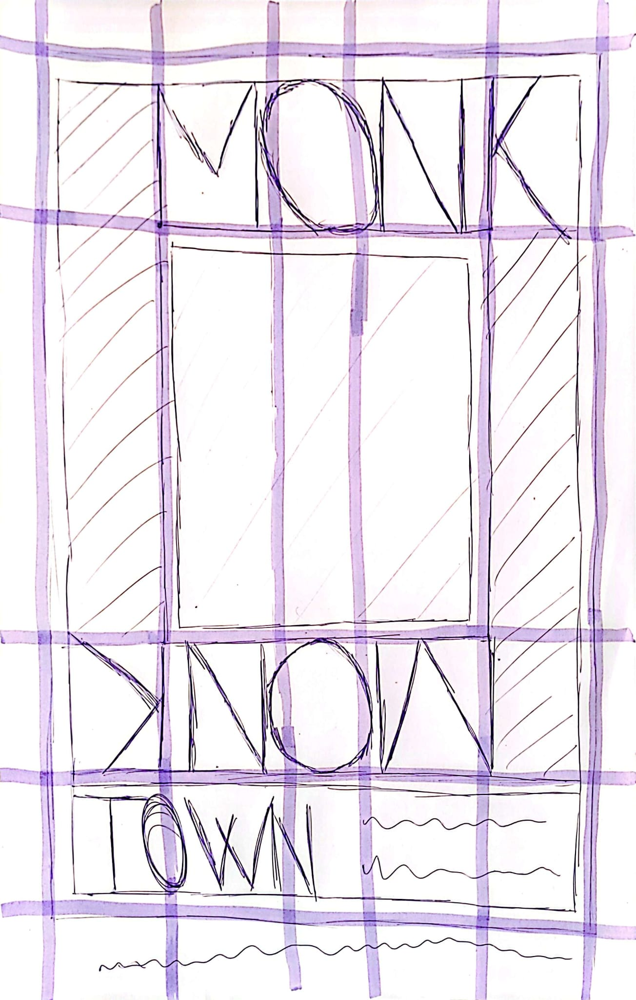

# Designing a website from a poster
This exercise was done following [this article](https://chenhuijing.com/blog/how-i-design-with-css-grid/) by Chen Hui Jing and [this Youtube playlist](https://www.youtube.com/playlist?list=PLbSquHt1VCf2irEuVf8c2hsoOMKyeQ2LO) presented by Jen Simmons and uploaded in Layout Land's channel. This exercise serves the purpouse of getting to know better the philosophy of designing a website while having CSS Grid on your mind.

## Before coding
Before opening our IDE, we need to select which poster we're going to base our design on. Jen Simmons uses Jazz at Lincoln Center Spring of 2007 poster, resulting on this website:


And Chen Hui Jing uses Tyco's artist profile by Drew Sullivan:


So, keeping it inside the music theme, we're chosing the poster for Thelonious Monk's New York' Town Hall concert on the 28th of February of 1959, by Dennis Loren:


First, let's divide the design as a grid.


Great, we've made a 5 by 4 grid. We could ask why we have 5 columns if we could get rid of the coloured one (the second one starting on your left). Chen Hui Jing does this to have more control over the flexible spacing we may need when we make our design responsive.

Now, let's make a sketch so we have our information simplified on pen and paper.



Now that we have our information simplified, let's select our fonts and colors to get them out of the way.

For the *Monk Thelonious* titles I chose [Faculty Glyphic](https://fonts.google.com/specimen/Faculty+Glyphic) because I found it had these proto seriffs that the original poster has. And we are going to use [Roboto](https://fonts.google.com/specimen/Roboto) for the place and date section.

This is the color palette:


## HTML Structure
Both Jen Simmons and Chen Hui Jing agree that we have to start by creating the basic structure of our web page. They also agree that the structure must make sense without applying any styles to it, so let's do it.

First, let's create our `index.html` file.

```html
<!DOCTYPE html>
<html lang="en">
  <head>
    <meta charset="utf-8" />

    <!-- External CSS -->
    <link rel="stylesheet" href="./styles/main.css" />

    <title>Monk Thelonious</title>
  </head>

  <body>
    <div class="container">
      <h1 class="title title--invisible">Monk Thelonious</h1>
      <h1 class="title title--top title--lowercase">Monk</h1>
      <h1 class="title title--right title--uppercase">Thelonious</h1>

      <figure class="figure">
        
        <figcaption class="figure__caption">
          Picture by cottonbro studio on Pexels.
        </figcaption>
      </figure>

      <h1 class="title title--invisible">Monk Thelonious</h1>
      <h1 class="title title--bottom title--lowercase">Monk</h1>
      <h1 class="title title--left title--uppercase">Thelonious</h1>

      <div class="date-place">
        <h2 class="date-place__place">Town Hall</h2>
        <p class="date-place__date">
          <span class="date-place--pointSeparator">Saturday </span>
          February 28th
          <span class="date-place--pointSeparator">113 West 438D st </span>
          New York
        </p>
      </div>
    </div>

    <!-- JavaScript -->
    <script src="./script/main.js"></script>
  </body>

  <!-- In-document CSS -->
  <style>
    /* ... */
  </style>
</html>
```

**Side note**: I'm using the BEM methdology for naming CSS classes. I made a [guide](../../Development%20methodologies/BEM/Guide.md) in this repo for it.

This HTML results in this page:


Notice that we duplicated the H1 headers because we need to split them. The full *Monk Thelonious* header will not display on the end result.

## Styles
First, we're going to stablish a base style for browsers that don't support CSS Grid, stating which colors and fonts we're going to use.

The result could look something like this:


We have something similar to the final result, but it's not quite there yet because we're not applying the grid.

Now that we've stablished the "default" styles, let's override them with the `@supports` CSS statement. This allows us to define a block of CSS rules that will only apply to the page if the browser supports whichever function we pass to the `@support` statement.

```css
.container {
  background-color: white;
}

@supports (display: grid) {
  .container {
    background-color: black;
  }
}
```

In this case, if the browser supports CSS Grid, the background of the container will be black. In any other case, it will be white.

For our website, we made it so if the browser supports CSS Grid, the main container will be a grid:

```css
@supports (display: grid) {
  .container {
    display: grid;
    grid-template-columns: [thelonious] 8vw [img1] 17vw [img3] 17vw [thelonious-reversed] 8vw;
    grid-template-rows: [monk] 0.5fr [img] 4fr [monk-reverser] .5fr [date-time] .5fr;

    /* ... */
  }
}
```

And by adjusting a lot of values and overriding the default ones, we made our poster design.


It's not responsive, but it ressembles the original design from the poster.
