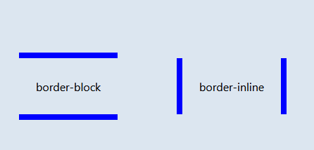

# Style Guide for HTML files

## Basic rules
 
- Use soft tabs with two spaces—they’re the only way to guarantee code renders the same in any environment.
- When grouping selectors, keep individual selectors to a single line.
- Include one space before the opening brace of declaration blocks for legibility.
- Place closing braces of declaration blocks on a new line.
- Include one space after : for each declaration.
- Each declaration should appear on its own line for more accurate error reporting.
- End all declarations with a semi-colon. The last declaration’s is optional, but your code is more error prone without it.
- Comma-separated property values should include a space after each comma (e.g., box-shadow).
- Use space-separated values for color properties (e.g., color: rgb(0 0 0 / .5)).
- You can adjust the alpha channel in the _rgb()_ function, so there's no need to use _rgba()_.
- Don’t prefix property values or color parameters with a leading zero (e.g., .5 instead of 0.5 and -.5px instead of -0.5px).
- Lowercase all hex values, e.g., #fff. Lowercase letters are much easier to discern when scanning a document as they tend to have more unique shapes.
- Use shorthand hex values where available, e.g., #fff instead of #ffffff.
- Quote attribute values in selectors, e.g., input[type="text"]. They’re only optional in some cases, and it’s a good practice for consistency.
- Avoid specifying units for zero values, e.g., margin: 0; instead of margin: 0px;.


```css
// Bad CSS
.selector, .selector-secondary, .selector[type=text] {
  padding:15px;
  margin:0px 0px 15px;
  background-color:rgba(0, 0, 0, 0.5);
  box-shadow:0px 1px 2px #CCC,inset 0 1px 0 #FFFFFF
}

// Good CSS
.selector,
.selector-secondary,
.selector[type="text"] {
  padding: 15px;
  margin-bottom: 15px;
  background-color: rgb(0 0 0 / .5);
  box-shadow: 0 1px 2px #ccc, inset 0 1px 0 #fff;
}
```

## Declaration order

Property declarations should be grouped together in the following order:

1. Positioning
2. Box model
3. Typographic
4. Visual
5. Misc

Positioning comes first because it can remove an element from the normal document flow and override box model related styles. The box model—whether it’s flex, float, grid, or table—follows as it dictates a component’s dimensions, placement, and alignment. Everything else takes place inside the component or without impacting the previous two sections, and thus they come last.

While border is part of the box model, most systems globally reset the box-sizing to border-box so that border-width doesn’t affect overall dimensions. This, combined with keeping border near border-radius, is why it’s under the Visual section instead.

Preprocessor mixins and functions should appear wherever most appropriate. For example, a border-top-radius() mixin would go in place of border-radius properties, while a responsive-font-size() function would go in place of font-size properties.

```css
.declaration-order {
  // Positioning
  position: absolute;
  top: 0;
  right: 0;
  bottom: 0;
  left: 0;
  z-index: 100;

  // Box model
  display: flex;
  flex-direction: column;
  justify-content: center;
  align-items: center;
  width: 100px;
  height: 100px;

  // Typography
  font: normal 14px "Helvetica Neue", sans-serif;
  line-height: 1.5;
  color: #333;
  text-align: center;
  text-decoration: underline;

  // Visual
  background-color: #f5f5f5;
  border: 1px solid #e5e5e5;
  border-radius: 3px;

  // Misc
  opacity: 1;
}
```

## Logical properties

Logical properties are alternatives to directional and dimensonal properties based on abstract terms like block and inline. By default, block refers to the vertical direction (top and bottom) while inline refers to the horizontal direction (right and left).



Not every language flows left-ro-right like English, so the writing mode needs to be flexible. With logical properties, you can easily support languages that can be written horizontally or vertically (like Chinese, Japanese, and Korean). Plus, they’re usually shorter and simpler to write.

```css
/* Border block */
.vertical-outdated {
  border-top: 2px dotted blue;
  border-bottom: 2px dotted blue;
}

.vertical-block {
  border-block: 2px dotted blue;
}

/* Border inline */
.horizontal-outdated {
  border-left: 5px dashed black;
  border-right: 5px dashed black;
}

.horizontal-inline {
  border-inline: 5px dashed black;
}
```

## Media query placement

Place media queries as close to their relevant rule sets whenever possible. Don’t bundle them all in a separate stylesheet or at the end of the document.

```css
.element { ... }
.element-avatar { ... }
.element-selected { ... }

@media (min-width: 480px) {
  .element { ... }
  .element-avatar { ... }
  .element-selected { ... }
}
```

## Single declarations

In instances where a rule set includes only one declaration, consider removing line breaks for readability and faster editing. Any rule set with multiple declarations should be split to separate lines.

```css
/* Single declarations on one line */
.icon           { background-position: 0 0; }
.icon-home      { background-position: 0 -20px; }
.icon-account   { background-position: 0 -40px; }

/* Multiple declarations, one per line */
.sprite {
  display: inline-block;
  width: 16px;
  height: 15px;
  background-image: url("../img/sprite.png");
}
```

## Shorthand notation

Limit shorthand declaration usage to instances where you must explicitly set all available values. Frequently overused shorthand properties include:

- `padding`
- `margin`
- `font`
- `background`
- `border`
- `border-radius`

Excessive use of shorthand properties leads to sloppier code with unnecessary overrides and unintended side effects.

```css
/* Bad example */
.element {    /* This fails because it's less readable */
  margin: 0 0 10px;
  background: red;
  background: url("image.jpg");
  border-radius: 3px 3px 0 0;
}

p {         /* This fails because the background shorthand overrides the background-color property */
  background-color: red;
  background: url(images/bg.gif) no-repeat left top;
}

/* Good example */
.element {  /* More readable and we know which value is affecting which property */
  margin-bottom: 10px;
  background-color: red;
  background-image: url("image.jpg");
  border-top-left-radius: 3px;
  border-top-right-radius: 3px;
}

p {         /* Now we specified that the image is the only background property affected */
  background-color: red;
  background-image: url(images/bg.gif) no-repeat left top;
}
```

## Preprocessors

- Avoid unnecesary nesting:

```css
/* Without nesting */
.table > thead > tr > th { … }
.table > thead > tr > td { … }

/* With nesting */
.table > thead > tr {
  > th { … }
  > td { … }
}

/* Bad nesting */
.table {
  thead {
    tr {
      > th { … }
      > td { … }
    }
  }
}
```
- When using math operators, wrap them in parentheses for readablity.

```css
// Bad example
.element {
  margin: 10px 0 @variable*2 10px;
}

// Good example
.element {
  margin: 10px 0 (@variable * 2) 10px;
}
```

## Classes

- Keep classes lowercase and use dashes (not underscores or camelCase). Dashes serve as natural breaks in related class (e.g., .btn and .btn-danger).
- Avoid excessive and arbitrary shorthand notation. .btn is useful for button, but .s doesn’t mean anything.
- Keep classes as short and succinct as possible.
- Use meaningful names; use structural or purposeful names over presentational.
- Prefix classes based on the closest parent or base class.
- Use .js-* classes to denote behavior (as opposed to style), but keep these classes out of your CSS.

```css
/* Bad example */
.t { ... }
.red { ... }
.header { ... }

/* Good example */
.tweet { ... }
.important { ... }
.tweet-header { ... }

/* Non prefixed classes */
.success { ... }
.btn.success { .. }
.alert.success { ... }

/* Prefixed classes */
.btn-success { ... }
.alert-success { ... }
```

What if one instance of `.success` uses green text on a white background while another uses white text on a green background?

Prefixed classes guide developers towards a simpler and more maintainable direction for building an extensive CSS design system. This way, the base class is at the component level and not the entire system level. In other words, our base classes have become .btn and .alert, not .success. There’s no bleeding of styles or behavior from one component to another here because we treat components in a “successful state” as an idea across the design system.

## Selectors

- Use classes over generic element tags for more explicit and reliable styling that isn’t dependent on your markup.
- Avoid using several attribute selectors (e.g., [class^="..."]) on commonly occuring components. Browser performance is known to be impacted by these.
- Keep selectors short and strive to limit the number of elements in each selector to three.
- Scope classes to the closest parent only when necessary (e.g., when not using prefixed classes).
- When necessary, it may be helpful to use the child combinator (>). Use it to limit styles to the immediate children elements of a parent element to avoid unnecessary overrides later on.

```css
/* Bad example */
span { ... }
.page-container #stream .stream-item .tweet .tweet-header .username { ... }
.avatar { ... }

/* Good example */
.avatar { ... }
.tweet-header .username { ... }
.tweet .avatar { ... }

.custom-table > tbody > tr > td,
.custom-table > tbody > tr > th {
  /* ... */
}
```

## Organization

- Organize sections of code by component.
- Develop a consistent commenting hierarchy.
- Use consistent white space to your advantage when separating sections of code for scanning larger documents.
- When using multiple CSS files, break them down by component instead of page. Pages can be rearranged and components moved.

```css
//
// Component section heading
//

.element { ... }


//
// Component section heading
//
// Sometimes you need to include optional context for the entire component. Do that up here if it's important enough.
//

.element { ... }

// Contextual sub-component or modifer
.element-heading { ... }
```

## Coments

Code is written and maintained by people. Ensure your code is descriptive, well commented, and approachable by others. Great code comments convey context or purpose. Do not simply reiterate a component or class name. Use the // syntax when writing CSS with preprocessors. When shipping CSS to production, remove all comments.

Be sure to write in complete sentences for larger comments and succinct phrases for general notes.

```css
/* Bad example */
/* Modal header */
.modal-header {
  ...
}

/* Good example */
/* Wrapping element for .modal-title and .modal-close */
.modal-header {
  ...
}
```
